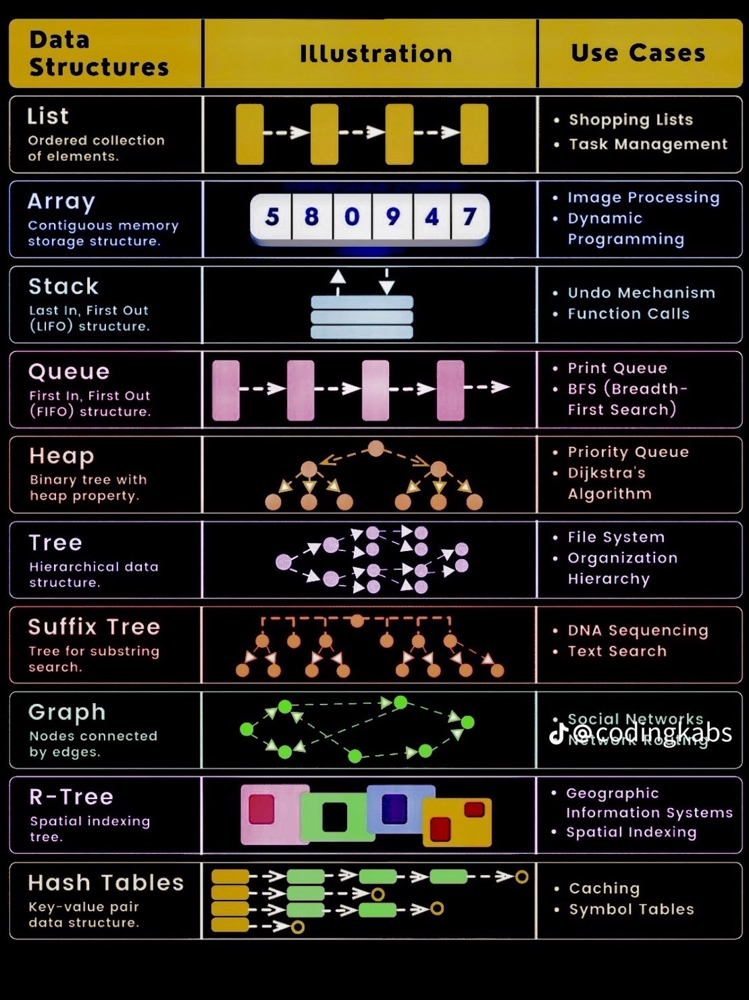

### Data Structure ###

# Dynamic Programming

# Linked List
operation

# Stack(LIFO)
Top = -1

operation
    - push() to insert an element into the stack  
    - pop() to remove an element from the stack
    - top() Returns the top element of the stack.
    - isEmpty() returns true if stack is empty else false.
    - size() returns the size of stack.

# Queue(FIFO)
Front = -1, Rear = -1

operation
    - dequeue() to insert an element into the queue
    - enqueue() to remove an element from the queue
    - isEmpty() returns true if queue is empty else false
    - size() returns the size of queue.